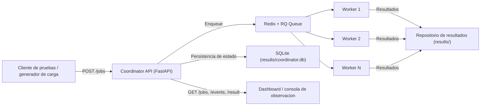
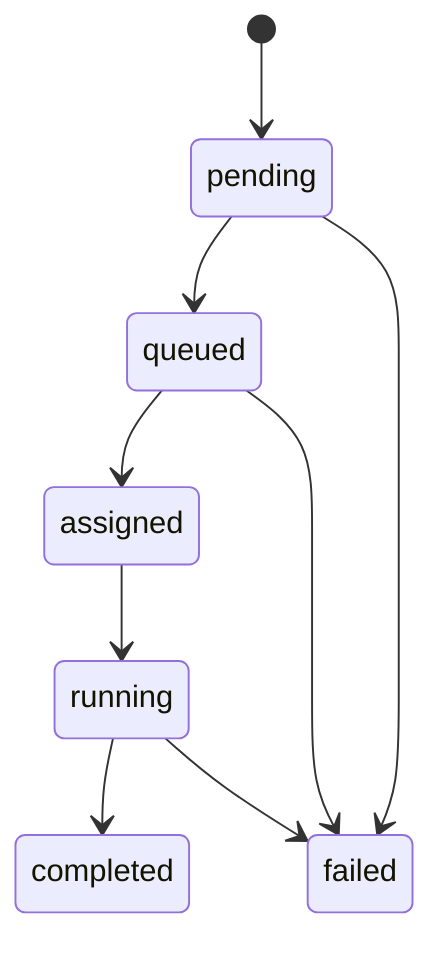

# Diseno Tecnico - Plataforma Distribuida Multimedia

Este documento cierra la primera iteracion de diseno tecnico para el sistema:

- arquitectura distribuida base
- ciclo de vida de jobs
- contratos API del coordinador
- estrategia de balanceo inicial
- modelo de datos persistente para jobs, resultados y eventos

## 1) Arquitectura propuesta



Decisiones base:

- El coordinador recibe solicitudes, registra estado persistente y encola tareas.
- Redis/RQ desacopla productor (coordinador) y consumidores (workers).
- El estado de control vive en SQLite (no en memoria).
- Los artefactos procesados se almacenan en `results/`.

## 2) Estados de job y transiciones

Estados canonicos:

- `pending`: job registrado, aun no encolado.
- `queued`: job en cola y pendiente de ejecucion por worker.
- `assigned`: worker reservado para ejecutar (estado reservado para siguiente iteracion).
- `running`: worker procesando activamente.
- `completed`: termino correctamente y tiene resultado asociado.
- `failed`: finalizo con error.



Reglas:

- Toda transicion relevante debe generar un evento en `job_events`.
- `completed` y `failed` son estados terminales.
- El progreso esperado va de `0` a `100`.

## 3) Contratos API (coordinador)

### 3.1 Crear job

- Metodo: `POST /jobs`
- Body:

```json
{
  "file_path": "dataset/video01.mp4",
  "operation": "extract_audio",
  "priority": 5
}
```

- Respuesta `201`:

```json
{
  "job_id": "c5f6a5b6-2db8-4750-b3ee-8bfce7cb8e6f",
  "status": "queued"
}
```

### 3.2 Listar jobs

- Metodo: `GET /jobs?status=queued&limit=100`
- Parametros:
  - `status` opcional (`pending|queued|assigned|running|completed|failed`)
  - `limit` opcional (1..1000)

### 3.3 Consultar un job

- Metodo: `GET /jobs/{job_id}`
- Respuesta incluye campos de trazabilidad:
  - identidad (`job_id`, `file_path`, `operation`)
  - control (`priority`, `status`, `progress`, `worker_id`, `rq_job_id`)
  - auditoria temporal (`created_at`, `queued_at`, `started_at`, `finished_at`, `updated_at`)
  - salida (`result_path`) o error (`error_message`)

### 3.4 Eventos de job

- Metodo: `GET /jobs/{job_id}/events`
- Devuelve la bitacora cronologica del job.

### 3.5 Resultado de job

- Metodo: `GET /jobs/{job_id}/result`
- Devuelve ubicacion y metadatos del resultado cuando exista.

## 4) Estrategia de balanceo (iteracion inicial)

Objetivo: distribuir carga en multiples workers con una cola compartida.

Estrategia definida:

- FIFO por defecto con soporte de prioridad en metadato del job.
- Workers competidores sobre la misma cola `jobs` (modelo pull).
- Reintentos y reasignacion se gestionaran por RQ en la siguiente iteracion.
- Se prioriza escalamiento horizontal de workers (`N` instancias) sobre tuning monolitico.

Evolucion planificada (sin implementar aun):

- colas por prioridad (`jobs_high`, `jobs_normal`, `jobs_low`)
- politica de asignacion basada en carga reportada por worker
- backoff/retry controlado por tipo de error

## 5) Modelo de datos persistente

Motor: SQLite (`COORDINATOR_DB_PATH`, default `results/coordinator.db`).

### 5.1 Tabla `jobs`

Campos clave:

- `job_id` (PK)
- `file_path`, `operation`
- `priority`
- `status`
- `worker_id`, `progress`
- `queue_name`, `rq_job_id`
- `result_path`, `error_message`
- `created_at`, `queued_at`, `started_at`, `finished_at`, `updated_at`

Uso:

- fuente de verdad del estado actual de cada trabajo
- consulta para dashboard y cliente

### 5.2 Tabla `job_events`

Campos clave:

- `event_id` (PK autoincremental)
- `job_id` (FK a jobs)
- `event_type`
- `status`
- `payload_json`
- `created_at`

Uso:

- trazabilidad completa de transiciones y eventos del job
- base para auditoria y diagnostico

### 5.3 Tabla `job_results`

Campos clave:

- `job_id` (PK y FK a jobs)
- `output_location`
- `metadata_json`
- `created_at`

Uso:

- catalogo persistente de resultados por trabajo
- soporte para descarga/consulta posterior

### 5.4 Indices

- `idx_jobs_status` sobre `jobs(status)`
- `idx_job_events_job_id` sobre `job_events(job_id)`

## 6) Criterios de aceptacion para estas 2 tareas

- Existe documento tecnico con arquitectura, estados, API y balanceo.
- El coordinador ya no usa almacenamiento en memoria para estado de jobs.
- Existe esquema persistente para `jobs`, `job_events` y `job_results`.
- Se puede crear y consultar jobs con estado persistido en SQLite.
